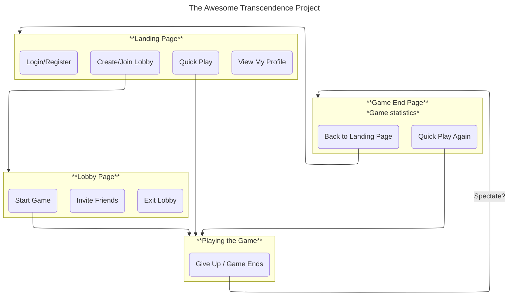

## The Awesome Transcendence Project

```mermaid
---
title: The Awesome Transcendence Project
---
flowchart-elk TB
    QUICK_PLAY(Quick Play)
    LOGIN_REGISTER(Login/Register)
    CREATE_LOBBY(Create/Join Lobby)
    EXIT_LOBBY(Exit Lobby)
    VIEW_PROFILE(View My Profile)
    INVITE_FRIENDS(Invite Friends)
    START_GAME(Start Game)
    GAME_ENDS(Give Up / Game Ends)
    QUICK_PLAY_AGAIN(Quick Play Again)
    BACK_TO_LANDING_PAGE(Back to Landing Page)
    
    subgraph LANDING_PAGE [**Landing Page**]
        LOGIN_REGISTER
        VIEW_PROFILE
        QUICK_PLAY
        CREATE_LOBBY
    end

    subgraph LOBBY_PAGE [**Lobby Page**]
        INVITE_FRIENDS
        START_GAME
        EXIT_LOBBY
    end

    subgraph PLAYING_THE_GAME [**Playing the Game**]
        GAME_ENDS
    end

    subgraph GAME_END_SCREEN [**Game End Page**<br>*Game statistics*]
        QUICK_PLAY_AGAIN
        BACK_TO_LANDING_PAGE
    end

    CREATE_LOBBY --> LOBBY_PAGE
    START_GAME --> PLAYING_THE_GAME
    QUICK_PLAY_AGAIN --> PLAYING_THE_GAME
    GAME_ENDS --> |Spectate?| GAME_END_SCREEN
    BACK_TO_LANDING_PAGE --> LANDING_PAGE
    QUICK_PLAY --> PLAYING_THE_GAME
```
