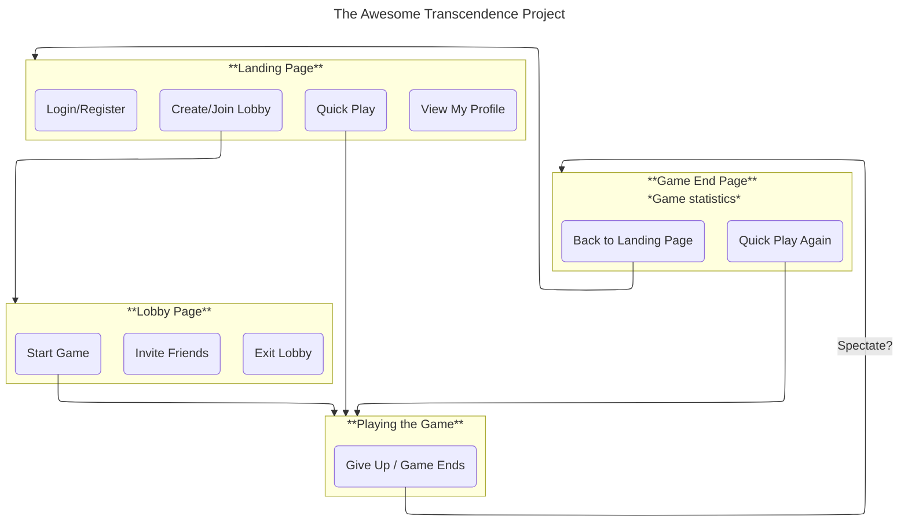

## The Awesome Transcendence Project



---

## Development Setup (Docker)

Everything runs in Docker. No local Node/npm needed for running the app.

### Stack

| Service  | Container             | Port (host)       |
|----------|-----------------------|-------------------|
| nginx    | transcendence_nginx   | `localhost:8080`  |
| frontend | transcendence_frontend| (via nginx)       |
| backend  | transcendence_backend | (via nginx)       |
| db       | transcendence_db      | `localhost:5432`  |

---

### First Time Setup

```bash
cp .env.example .env   # create your local .env (only needed once)
make setup             # builds all Docker images
make dev               # starts the full stack
```

App runs at: **http://localhost:8080**

---

### Daily Start / Stop

```bash
make dev       # start everything
make down      # stop everything (data stays in DB volume)
make logs      # follow all logs (Ctrl+C to exit)
```

---

### When to Rebuild

Hot-reload is active for both frontend and backend — editing source files restarts automatically.

**Rebuild is only needed when you change:**
- `Dockerfile` (any service)
- `package.json` or `package-lock.json`
- `nginx/nginx.conf`

```bash
make rebuild            # rebuild all images + restart
make rebuild-backend    # rebuild backend only
make rebuild-frontend   # rebuild frontend only
```

---

### Starting Individual Services

```bash
make backend    # start only db + backend  (API at /api/v1)
make frontend   # start only frontend + nginx
```

Useful when you only need to work on one side without starting everything.

---

### Start Only Frontend or Backend (without Make)

```bash
# backend + db only
docker compose up -d db backend

# frontend + nginx only
docker compose up -d frontend nginx

# single service logs
docker compose logs -f backend
docker compose logs -f frontend
```

---

### Full Reset (clean DB)

```bash
make clean    # removes containers AND volumes (DB is wiped)
make setup    # rebuild from scratch
make dev
```

---

### Before Pushing to Git

1. **Make sure the app still runs**
   ```bash
   make dev
   # open http://localhost:8080 and check your changes
   ```

2. **Run the linter** (backend only — BiomeJS)
   ```bash
   make lint-check    # check for issues
   make lint          # auto-fix formatting
   ```

3. **Stage only the files you changed**
   ```bash
   git status                         # see what changed
   git diff                           # review unstaged changes
   git add backend/src/features/...   # add specific files
   # avoid: git add .  (can include .env, build artifacts)
   ```

4. **Commit with a clear message**
   ```bash
   git commit -m "feat: short description of what you did"
   ```
   Prefixes: `feat:` new feature · `fix:` bug fix · `refactor:` cleanup · `docs:` docs only

5. **Push to your branch** (never push directly to `main`)
   ```bash
   git push origin your-branch-name
   # then open a PR on GitHub
   ```

---

### Useful Make Commands

```bash
make ps              # list running containers + status
make db-shell        # open psql in the database
make backend-shell   # open shell in backend container
make frontend-shell  # open shell in frontend container
make logs-backend    # backend logs only
make logs-frontend   # frontend logs only
make logs-db         # database logs only
```
