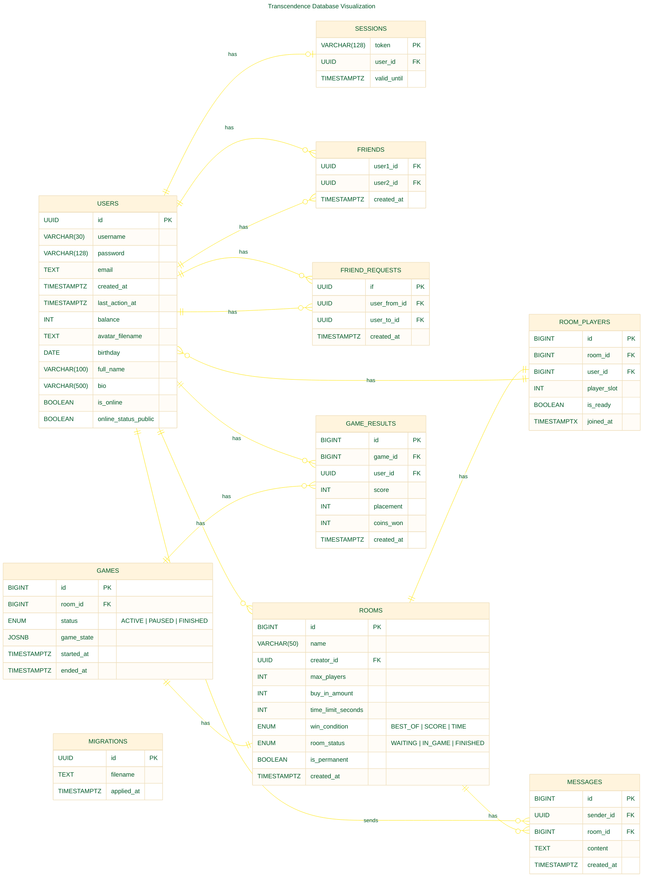

<i>This project has been created as part of the 42 curriculum by [**rreimann**](https://github.com/MM1132), [**cmakario**](https://github.com/conmak8), [**kkaratsi**](https://github.com/karatsioris), [**nlewicki**](https://github.com/nlewicki) and [**chuhlig**](https://github.com/cuhlig42)</i>
## The Awesome Transcendence Project

## Description
Ever wanted to play the good old snake game online with your friends? Our project (named **BLACK MAMBA**) is **THE** choice for you! Log into https://snake.reimann.ee, invite your best friend(s), and beat them in the ultimate snake showdown! 

## Installation instructions:
- Make sure you have Docker installed. Check out Docker's official website: [LINK](https://www.docker.com)
- Clone the project: `git clone https://github.com/MM1132/ft_transcendence.git`
- Get into the project directory: `cd ft_transcendence`
- Copy-paste `.env.example` file and rename it `.env`: `cp .env.example .env`
- Default settings from `.env.example` file work for local setup out of the box, you can change them depending on your specific needs. 
- Run the project: `docker compose up -d --build`
- In the browser, go to `http://localhost`
- View logs `docker compose logs frontend -f` 
- Stop the app: `docker compose down`

Both frontend and backend are automatically hot-reloaded when you save files. 

As a developer, you can also access the PostgreSQL database directly, see `docker-compose.yml` file for the connection details. 

### Install new npm packages during development:
- Sh into the container: `docker compose exec frontend sh`
- And then install the desired package `npm i <package name>`  
package.json and node_modules are automatically updated in your host machine

Happy developing! :) 

## Team Formation

| Member Name | Role | Responsibilities |
| --- | --- | --- |
| [**rreimann**](https://github.com/MM1132) | PO (Project Owner) | Setting up the project. Backend REST API, continous deployment. Monitoring the development processes and guiding the team. |
| [**nlewicki**](https://github.com/nlewicki) | PM (Project Manager) | Developing lots of frontend, finding and fixing bugs. Responsive web design. Testing the application vigorously. |
| [**kkaratsi**](https://github.com/karatsioris) | UI/UX Lead | Creating the website styling guidelines, leading the frontend team with exemplary coding practices. Making sure that frontend developers do their job right. |
| [**cmakario**](https://github.com/conmak8) | Frontend Dev | The frontend for the most important part of the project - game itself in both multiplayer and singleplayer. |
| [**chuhlig**](https://github.com/cuhlig42) | Backend Dev | Developing backend for the game, rooms, and the real-time chatting capabilities. |

## Project Management
Semi-regular standup-style team meetings in the early mornings before Nico had to go to uni and Robert to Level 3. 
### Tools
- Github: Issues, Pull Requests with reviews, Webhooks for CI/CD
- Figma: Creating frontend styles
- Discord: Our main communication channel

## Technical Stack
There are 4 parts of our application, each of them playing a critical role in the functioning of the application as a whole:
- Backend: Using the [Fastify](https://fastify.dev) framework, responsible for the core logic of the application. REST API and WebSockets for communication. Fastify was chosen for it's speed and low boilerplate code requirements. Talks to Nginx and Database. 
- Frontend: Coded with [Svelte](https://svelte.dev) framework. Makes requests towards our Nginx, cannot access Backend or Database directly. Svelte was choses for it's speed and simplicity compared to the most-popular web framework React. 
- Database: Using the open source [PostgreSQL](https://www.postgresql.org) to store all our data. It was chosen because it is open source and easy to work with. Also, knowing how to use a relational database was good knowledge for us. 
- Reverse proxy: [Nginx](https://nginx.org), works as a security layer, as all the requests towards our application must go through it! Nginx was chosen for being the most popular and videly adopted industry standard. 

## Database Schema

```mermaid
---
title: Transcendence Database Visualization
config:
  theme: 'base'
  themeVariables:
    #primaryColor: '#BB2528'
    primaryTextColor: '#005828'
    #primaryBorderColor: '#7C0000'
    lineColor: '#ffe600'
    secondaryColor: '#ff0000'
    tertiaryColor: '#fff'
---
erDiagram
	direction LR

	USERS ||--o| SESSIONS : has
	USERS ||--o{ FRIENDS : has
	USERS ||--o{ FRIENDS : has
	USERS ||--o{ FRIEND_REQUESTS : has
	USERS ||--o{ FRIEND_REQUESTS : has

	%% Each user has have zero or more rooms they have created
	USERS ||--o{ ROOMS : has

	ROOMS ||--|| ROOM_PLAYERS : has
	ROOM_PLAYERS ||--o{ USERS : has
	USERS ||--o{ GAME_RESULTS : has
	GAMES ||--o{ GAME_RESULTS : has
	USERS ||--o{ MESSAGES : sends
	ROOMS ||--o{ MESSAGES : has
	GAMES ||--|| ROOMS : has

	USERS {
		UUID id PK
		VARCHAR(30) username
		VARCHAR(128) password
		TEXT email
		TIMESTAMPTZ created_at
		TIMESTAMPTZ last_action_at
		INT balance
		TEXT avatar_filename
		DATE birthday
		VARCHAR(100) full_name
		VARCHAR(500) bio
		BOOLEAN is_online
		BOOLEAN online_status_public
	}

	SESSIONS {
		VARCHAR(128) token PK
		UUID user_id FK
		TIMESTAMPTZ valid_until
	}

	FRIENDS {
		UUID user1_id FK
		UUID user2_id FK
		TIMESTAMPTZ created_at
	}

	FRIEND_REQUESTS {
		UUID if PK
		UUID user_from_id FK
		UUID user_to_id FK
		TIMESTAMPTZ created_at
	}

	MIGRATIONS {
		UUID id PK
		TEXT filename
		TIMESTAMPTZ applied_at
	}

	%% And the parts that I don't understand so well
	GAME_RESULTS {
		BIGINT id PK
		BIGINT game_id FK
		UUID user_id FK
		INT score
		INT placement
		INT coins_won
		TIMESTAMPTZ created_at
	}

	GAMES {
		BIGINT id PK
		BIGINT room_id FK
		ENUM status "ACTIVE | PAUSED | FINISHED"
		JOSNB game_state
		TIMESTAMPTZ started_at
		TIMESTAMPTZ ended_at
	}

	MESSAGES {
		BIGINT id PK
		UUID sender_id FK
		BIGINT room_id FK
		TEXT content
		TIMESTAMPTZ created_at
	}

	ROOM_PLAYERS {
		BIGINT id PK
		BIGINT room_id FK
		BIGINT user_id FK
		INT player_slot
		BOOLEAN is_ready
		TIMESTAMPTX joined_at
	}

	ROOMS {
		BIGINT id PK
		VARCHAR(50) name
		UUID creator_id FK
		INT max_players
		INT buy_in_amount
		INT time_limit_seconds
		ENUM win_condition "BEST_OF | SCORE | TIME"
		ENUM room_status "WAITING | IN_GAME | FINISHED"
		BOOLEAN is_permanent
		TIMESTAMPTZ created_at
	}
```

## Features List
> Tasks were split, mostly between who did backend and who did frontend. 
- Login/Register with Sessions
- Chat system with persistent messages
- Friends/Friend requests
- Create/delete rooms
- Kick others from your room
- Online users list / Friends list
- Multiplayer snake game with live updates
- Singleplayer snake game
- User profile pages
- User settings that can be changed
### Technical (features for developers)
- Custom database migrations system
- Automatic simple setup with Docker compose
- Full API specification with Bruno
- BiomeJS/Nodemon/TypeScript configuration

## Modules
TODO

## Individual Contributions
TODO

## Resources
> AI was used with care and comfort. No chatbots were harmed in the creation of this project.  
### We used AI <u>only</u> for:
- All backend Websocket/Chat/Rooms/Game parts
- Generating SQL statements
- Helping to fix and find bugs in our code
- The software development design patterns and best practices
- Nginx configuration and CI/CD to snake.reimann.ee
- Reviewing our Pull Requests with copilot  
### AI was NOT used for:
- Writing this Readme
